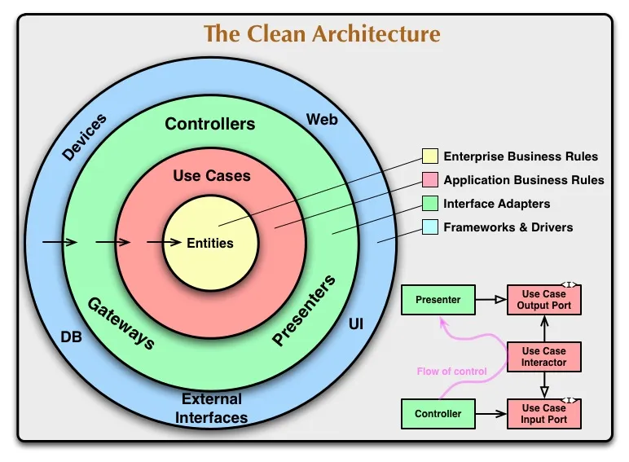

# Transportation Management App – Backend

## 📝About the Project


Welcome to the backend of the **Transportation Management App**, a robust and scalable system designed to manage travelers, routes, ticketing, and vehicle operations. This project is architected with **Clean Architecture** principles to ensure high modularity, testability, and long-term maintainability. This project is inspired by sites like Booking.com and Alibaba.ir

💡 This backend is designed to work seamlessly with the [Transportation Management Frontend](https://github.com/MehrdadShirvani/AlibabaClone-Frontend), a React-based SPA that consumes the RESTful APIs exposed by this project.

---


## 🛠️ Tech Stack

| Layer              | Technologies                                                                                                                                                                                                                                                                                                                                                                                                                                                                                                                                                                                                                                                                                                                                                              |
| ------------------ | ------------------------------------------------------------------------------------------------------------------------------------------------------------------------------------------------------------------------------------------------------------------------------------------------------------------------------------------------------------------------------------------------------------------------------------------------------------------------------------------------------------------------------------------------------------------------------------------------------------------------------------------------------------------------------------------------------------------------------------------------------------------------- |
| Presentation (API) |      <br><br>                                                     |
| Application        |                                                                                                                                                                                                                                                                                                                                                                                                                                                                                                                                                                                                             |
| Infrastructure     | ,        |
| Domain             | <br>                                                                                                                                                                                                                                                                                                                                                                                                                                                                                                                                                                                                                                                                                             |

---

## 🧭Architecture Overview

This project follows **Clean Architecture** as its foundation, separating the system into clearly defined layers:

### 🌀 Core Layers


Reference: [View this article](https://medium.com/@rudrakshnanavaty/clean-architecture-7c1b3b4cb181)

### 1. **Domain Layer**
**Description:**  
Contains the **Enterprise Business Rules** – the core of the system. This layer is **completely independent** of any frameworks or infrastructure.

**Includes:**
- **Entities:** Pure business objects like `Account`, `Person`, `TicketOrder`
- **Enums and Rules:** Domain constraints and constants
- **Interfaces:** Contracts like `IEntity<TKey>`, `IRepository<T>`
    
**Domain Modeling Details:**


- ✅ ERD follows **Third Normal Form (3NF)** to avoid redundancy and ensure referential integrity.
- ✅ Uses a **Code-First Approach**: database schema generated from C# model classes.
- ✅ Base Entity & Interface provide **consistency** and **generic flexibility**:

```csharp
public interface IEntity<TKey>
{
    public TKey Id { get; set; }
}
```
- Generic base class `Entity<TKey>` standardizes ID usage:

```csharp
public class Account : Entity<long>
{
    public required string PhoneNumber { get; set; }
    public required string Password { get; set; }
    public string? Email { get; set; }
    public long? PersonId { get; set; }
    public decimal CurrentBalance { get; private set; }

    public virtual Person? Person { get; set; }
    public virtual BankAccountDetail? BankAccountDetail { get; set; }
    public virtual ICollection<Transaction> Transactions { get; set; }
    public virtual ICollection<TicketOrder> BoughtTicketOrders { get; set; }
    public virtual ICollection<AccountRole> AccountRoles { get; set; }
    public virtual ICollection<Person> CreatedPeople { get; set; }

    public void Deposit(decimal amount) { ... }
    public void Withdraw(decimal amount) { ... }
}
```

### 2. Application Layer
**Description:**  
Contains the **Use Cases** and orchestrates domain logic without depending on external concerns. Acts as the **bridge between the domain and outside world** (e.g., API controllers).

**Key Responsibilities:**

1. **Application Services**
       - Defines service contracts like `IAuthService`, `ITransportationService`
    - Operates on DTOs, uses repositories and domain logic
    - Returns structured `Result<T>` objects
2. **Use of DTOs + AutoMapper**
	- Entities are **never exposed directly** to the API
    - Uses **Data Transfer Objects (DTOs)** to control data flow
    - Maps entities to DTOs and vice versa, using AutoMapper:

```csharp
CreateMap<City, CityDto>();
```
        
3. **Result Wrapping with `Result<T>`**
    - All service responses are wrapped in a **`Result<T>`** class, which:
        - Unifies success/error response logic
        - Enhances readability
        - Avoids throwing exceptions for business flow
        - Enables easy status mapping at controller level
    Example structure:
    ```csharp
    public class Result<T>
    {
        public ResultStatus Status { get; set; }
        public string? ErrorMessage { get; set; }
        public T? Data { get; set; }
        public bool IsSuccess => Status == ResultStatus.Success;
    
        public static Result<T> Success(T data) => ... };
        public static Result<T> Error(string errorMessage) => ... };
        public static Result<T> NotFound() => new() { ... };
        public static Result<T> Unauthorized() => new() {... };
    }
    ```
    
    With corresponding status `enum`:
    
    ```csharp
    public enum ResultStatus
    {
        Success,
        NotFound,
        ValidationError,
        Conflict,
        Unauthorized,
        Forbidden,
        Error
    }
    ```
### 3. Infrastructure Layer
**Description:**
This layer provides the actual **implementations** of interfaces defined in the Domain and Application layers. It deals with **data access**, **external services**, **file storage**, and **configuration** of frameworks like Entity Framework.

---
**Entity Framework Core (EF Core)**
The project uses **EF Core** as the ORM (Object-Relational Mapper) for interacting with a **SQL-based relational database** (SQL Server).

- The **`DbContext` implementation** is called `ApplicationDBContext`, which manages access to all entities and repositories.
- Repositories are injected into services via dependency injection and **work through `ApplicationDbContext`**.

---
**Entity Configurations**
EF Core configurations are applied using the **Fluent API**, via `IEntityTypeConfiguration<T>` classes.
Example:

```csharp
public class AccountConfiguration : IEntityTypeConfiguration<Account>
{
    public void Configure(EntityTypeBuilder<Account> builder)
    {
        builder.HasKey(a => a.Id);
        builder.Property(a => a.Id).ValueGeneratedOnAdd();

        builder.Property(a => a.PhoneNumber)
            .IsRequired()
            .IsUnicode(false)
            .HasMaxLength(20);

        //...

		//Relationships
        builder.HasOne(a => a.Person)
            .WithOne()
            .HasForeignKey<Account>(a => a.PersonId)
            .OnDelete(DeleteBehavior.Restrict);
    }
}
```
---

**Migrations**
- The project follows **Code-First Migrations** using EF Core.
- Database schema is automatically created and updated using:
    
    ```bash
    dotnet ef migrations add InitialCreate
    dotnet ef database update
    ```
    
- This enables safe, version-controlled database evolution as the domain model changes.
---

**Repository Pattern & Unit of Work**
This app uses the **Repository Pattern** and **Unit of Work** to encapsulate data access logic and abstract away infrastructure concerns like Entity Framework Core.

**Benefits:**
- Abstraction from ORM
- Better Code Organization
- Improved Testability
- Encapsulation of Query Logic
- Centralized and Consistent Data Access

**Implementation Structure:**
1. **Interfaces in the Domain Layer**
    - `IRepository<T>`: Generic base repository interface
    - `IEntityRepository` or other entity-specific interfaces (e.g., `ITicketOrderRepository`)
    - These define contracts for data access and allow the application and domain layers to remain independent of implementation details.
2. **Implementations in the Infrastructure Layer**
    - `Repository<T>`: A generic implementation of `IRepository<T>` using Entity Framework
    - Entity-specific repositories (e.g., `TicketOrderRepository`) implement their respective interfaces
    - Infrastructure-specific logic like query optimizations and eager loading are encapsulated here
3. **Unit of Work**
    - Wraps repository access in a single transactional boundary
    - Guarantees:
        - **Data Consistency**
        - **Performance**
        - **Atomicity across multiple repositories**

### 4. **Presentation Layer (API)**

**Description:**  
This layer contains the **HTTP API** controllers that expose the application's features to clients like the React frontend, mobile apps, or third-party services.

---

**Responsibilities:**
- **Provides RESTful endpoints** for all operations (CRUD, queries, authentication)
- **Maps HTTP verbs to application services** (`GET`, `POST`, `PUT`, `PATCH`, `DELETE`)
- **Accepts and returns DTOs** – never exposes domain entities
- **Keeps logic minimal** – delegates all behavior to the Application Layer
- **Uses attributes and filters** for model validation, authorization, and routing
- **Returns structured HTTP responses** with meaningful status codes (`200`, `201`, `400`, `404`, `500`, etc.)
---

**REST Compliance:**
The presentation layer adheres to **REST principles** like:
- **Statelessness**
- **Resource identification via URIs**
- **Proper use of HTTP methods**
- **Standard status codes**
---

**Dependency Injection Setup**
The app uses **constructor-based dependency injection** to wire up all services and repositories via the built-in `.NET Core DI container`.

All interfaces from the **Domain** and **Application** layers are registered with their **Infrastructure** or **Application** implementations in `Program.cs`:

```csharp
builder.Services.AddScoped<ICityRepository, CityRepository>();
builder.Services.AddScoped<ILocationRepository, LocationRepository>();
builder.Services.AddScoped<IAuthService, AuthService>();
builder.Services.AddScoped<ITransportationService, TransportationService>();
//...
```

This approach:
- Promotes **loose coupling**
- Supports **easy testing and mocking**
- Enables **lifetime control** (`Scoped`, `Singleton`, `Transient`)
- Keeps project **modular and extendable**

---

## 🧩 Key Features

### Core Functionality

- **Full CRUD** support for all domain entities.
- **Advanced Transportation Search**: Supports optional filters like `vehicleType`, `departure/arrival cities`, and `start/end time`.
- **Ticket Ordering System**:
    - Supports both individual and group purchases.
    - Allows one buyer and multiple travelers.
    - Coupon support and auto-generated **PDF ticket** using QuestPDF.
- **Transaction Logging & Reports**:
    - All transactions (e.g., top-up, ticket purchase) are logged.
    - Export account transaction history as **CSV**.
### Authentication & Authorization

- **Custom JWT Authentication**:
    - Auth token is generated with a custom method, embedding account roles and account data.
    - Each `Account` supports **multiple roles** through a join table (`AccountRole`).
- **Role-Based Authorization** integrated into API endpoints.
- **Password Hashing** using **SHA256** for secure credential storage.

### User & Account Management
- Add and manage personal details, bank account information, and saved people.
- View and manage traveler profiles associated with ticket orders.

### Architecture & Scalability

- Built with **Clean Architecture** principles: layered, testable, decoupled.
- **Interface-driven Services** (e.g., `IAuthService`, `ITransportationService`) for modular growth.
- **AutoMapper** used to separate DTOs from domain models cleanly.
- Structured response handling with a **Result** wrapper for service responses.
- **Dependency Injection** used throughout for loose coupling and flexibility.
- **Persistence-Agnostic**: Business logic is decoupled from EF Core and SQL Server.
    

### Testability & Maintainability
- High **testability** through separation of concerns and use of interfaces.
- Easy to switch out implementations or add new providers thanks to DI and layered structure.
- **Application layer** remains untouched when swapping infrastructure components.
  
---

## 📁 Project Structure

```
/src
 ┣ /Domain
 ┃ ┣ Aggregates/
 ┃ ┣ Framework/
 ┃   ┣ Base/
 ┃   ┣ Interfaces/
 ┣ /Application
 ┃ ┣ DTOs/
 ┃ ┣ Interfaces/
 ┃ ┣ Mappers/
 ┃ ┣ Result/
 ┃ ┣ Services/
 ┃ ┗ Utils/
 ┣ /Infrastructure
 ┃ ┣ Persistence/
 ┃ ┣ ExternalAPIs/
 ┃ ┗ Mappings/
 ┣ /WebAPI
 ┃ ┣ Authentication/
 ┃ ┣ Controllers/
 ┃ ┣ appsettings.json
 ┃ ┗ Program.cs
 ┗ /Tests
   ┣ Unit/
   ┗ Integration/
```

---
## 🔐 Security

The backend uses **JWT (JSON Web Token)** authentication with **role-based access control** to secure API endpoints.

**Highlights:**
- ✅ **Stateless**: No server-side session; each request carries a token.
- 🔐 **Roles Included**: User roles are embedded in the token payload and enforced via policy-based authorization.
- 📦 **Library Used**: `Microsoft.AspNetCore.Authentication.JwtBearer`
- 🎯 Ideal for SPAs like the React frontend.

Tokens follow the standard **`Header.Payload.Signature`** structure, and are passed via the `Authorization: Bearer <token>` header.

---
## 🌐 API Design Principles

This backend adheres to **RESTful design** principles for clarity, scalability, and consistency across client-server communication.

### Key REST Principles Followed
1. **Statelessness**  
    Each HTTP request contains all necessary information; no server-side session state is maintained.
2. **Resource Identification via URIs**  
    Resources like `accounts`, `tickets`, and `transportations` are identified using clean, noun-based endpoints.
    
3. **Standard HTTP Methods**
    - `GET` – Retrieve data
    - `POST` – Create new records
    - `PUT` – Fully update existing records
    - `DELETE` – Remove a resource

4. **Standard HTTP Status Codes**  
    Responses use appropriate status codes like:
    - `200 OK`
    - `201 Created`
    - `404 Not Found`
    - `500 Internal Server Error`

---
## 🚀 Getting Started

If you're planning to **test or contribute** to the project, make sure to:

### 🔀 1. Switch to the `develop` Branch

The `develop` branch contains the latest features and active work in progress.

```bash
git checkout develop
```

---

### ⚙️ 2. Configure `appsettings.json`

#### ✅ Add Database Connection

Update your connection string in `appsettings.json`:

```json
{
  "ConnectionStrings": {
    "DefaultConnection": "Server=YOUR_SERVER;Database=YOUR_DB;Trusted_Connection=True;TrustServerCertificate=True"
  }
}
```

Make sure the values match your **local SQL Server** setup.

---

#### 🔐 Add JWT Settings

To enable JWT-based authentication, also include:

```json
"Jwt": {
  "Key": "YOUR_SECRET_KEY_HERE",
  "Issuer": "YOUR_APP_NAME_OR_DOMAIN",
  "Audience": "MyAppUsers",
  "ExpiryMinutes": 360
}
```

---

### 🗄️ 3. Run Database Migrations

To create the schema and apply the current migrations:

```bash
dotnet ef migrations add InitialCreate
dotnet ef database update
```

✅ This sets up your SQL database using the current domain models and Entity Framework configuration.

---
## 🧪 Testing


---

## 🤝 Contributing

We follow Clean Architecture not just in code but in our workflow. PRs should:
- Target the correct layer.
- Avoid leaking infrastructure logic into core layers.
- Include tests for new business logic.

---

## 📚 Resources
### Architecture and Design
- **Clean Architecture**:  
    [Clean Architecture](https://medium.com/@rudrakshnanavaty/clean-architecture-7c1b3b4cb181)

- **Dependency Injection in .NET Core**:  
    [Dependency Injection](https://learn.microsoft.com/en-us/dotnet/core/extensions/dependency-injection)
### Entity Framework Core (EF Core)
- **EF Core Code First Tutorial (Video)** by Patrick God:  
     [.NET 8 Web API & Entity Framework 🚀 Full CRUD Course (with Code-First Migrations & SQL Server)](https://www.youtube.com/watch?v=b8fFRX0T38M&ab_channel=PatrickGod)
- **EF Core Modeling & Configurations (Official Docs):**  
      [Creating and Configuring a Model](https://learn.microsoft.com/en-us/ef/core/modeling/)
### Repository & Unit of Work Patterns
- **Repository Design Pattern (Video)** by Patrick God:  
	 [The Repository Pattern explained for EVERYONE (with Code Examples) 🚀](https://www.youtube.com/watch?v=Wiy54682d1w&ab_channel=PatrickGod)
- **Generic Repository Pattern** by Milan Jovanović
	 [How I Use The Generic Repository Pattern In Clean Architecture](https://www.youtube.com/watch?v=kwehxBDX_o8&ab_channel=MilanJovanovi%C4%87)
- **Repository & Unit of Work Pattern (Video) by Mosh**  
    [Repository Pattern with C# and Entity Framework, Done Right | Mosh](https://youtu.be/rtXpYpZdOzM?t=703)
- **Infrastructure & Persistence Layer Design (Microsoft Docs):**  
    [Design the infrastructure persistence layer](https://learn.microsoft.com/en-us/dotnet/architecture/microservices/microservice-ddd-cqrs-patterns/infrastructure-persistence-layer-design)
### AutoMapper
- **Official AutoMapper documentation:**  
    [https://automapper.org/](https://automapper.org/)
### RESTful API Principles
- **REST API Tutorial & Best Practices:**
    [https://restfulapi.net/](https://restfulapi.net/)

### JWT Authentication
- **JWT Introduction and Guide (jwt.io):**
    [https://jwt.io/introduction/](https://jwt.io/introduction/)
    
### Miscellaneous
- **`QuestPDF`** (PDF generation library example used in project):  
    [QuestPDF GitHub](https://github.com/QuestPDF/QuestPDF-ExampleInvoice)

---

## 🐦‍🔥 Order of the Phoenix
This project is part of the first initiative by **The Order of the Phoenix** — a student-led movement aimed at building a culture of self-driven learning, teamwork, and meaningful project development. What started as a grassroots .NET learning group evolved into a full-stack travel management system inspired by platforms like Alibaba.ir, built with clean architecture on the backend and a modern React frontend.

 🔗 For more information, and to explore the full documentation and creation process, visit: **[ASP.NET Project Documentation](https://theorderofphoenix.github.io/ASP.NET/)**  


I should specially thank:

[Amin Ghoorchian](https://github.com/AminGh05)

[Ali Taherzadeh](https://github.com/AliThz)

For their guidance, help and accompaniment.

---

## 📝 License

MIT License – see `LICENSE` file for details.

